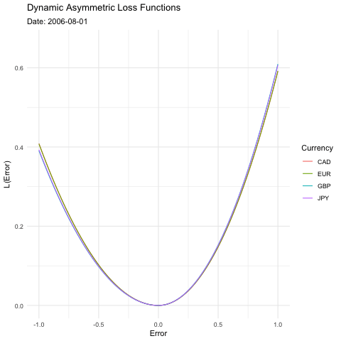

# cam-diss
Quantile Analysis Approach to the Forward premium Bias

---
#### Notes
The data is pulled from the Refinitiv LSEG Workspace
- The data is stored in the `data` folder
Function form for the data pull in Excel is:

`=@RDP.Data("GBP1MV=;EUR1MV=...", "TR.BIDPRICE;TR.ASKPRICE;TR.MIDPRICE;TR.MIDPRICE.DATE", "SDate=2000-01-01 Frq=D EDate=0 CH=Fd RH=IN")`
EDate = 0 just means the end date is today. Getting the date from this TR.MIDPRICE.DATE function.

## Bloomberg Data through BQL
Using Bloomberg data to pull this for a larger set of countries. The countries include: US, UK, EU, JP, CA, CH, KR, TH.

### Currency Data
`=BQL("list(['USDCHF Curncy', 'USDTHB Curncy', 'USDKRW Curncy', 'USDVND Curncy', 'USDSGD Curncy', 'USDGBP Curncy', 'USDCAD Curncy', 'USDEUR Curncy', 'USDJPY Curncy'])", "dropna(px_last(dates =range(2000-01-01, 2005-01-01)))")`

### Forward Data
`=BQL("curvemembers(['USDCHF Curncy', 'USDTHB Curncy', 'USDKRW Curncy', 'USDVND Curncy', 'USDSGD Curncy', 'USDGBP Curncy', 'USDCAD Curncy', 'USDEUR Curncy', 'USDJPY Curncy'], curve_type = fx, quote_type =OUTRIGHT, tenors = 1M)", "dropna(rate(dates =range(2000-01-01, 2005-01-01)))")`

### Policy Rate
`=BQL("list(['US Country', 'GB Country', 'JP Country', 'CA Country', 'CH Country', 'SG Country', 'KR Country', 'TH Country', 'EU Country'])", "dropna(policy_rate(as_of_date=range(2000-01-01, 2005-01-01)))")`

### Unemployment
`=BQL("list(['US Country', 'GB Country', 'JP Country', 'CA Country', 'CH Country', 'SG Country', 'KR Country', 'TH Country', 'EU Country'])", "dropna(unemployment(as_of_date=range(2000-01-01, 2005-01-01), transform=PCT, pt = m))")`

---
## Some results
We can see how the market level loss functions vary over time only slightly, while all staying consistent in the systematic overprediction of the appreciation of the USD.

