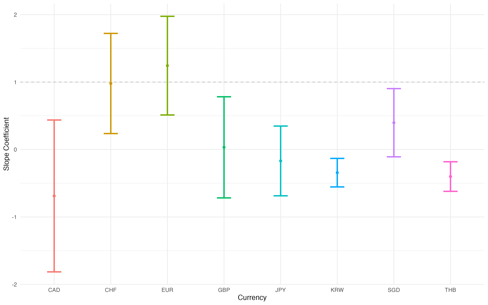

# Missed Profits Caused by Misspecifying Loss Functions

By estimating time-varying asymmetry in market loss preferences using GMM, we find strong evidence that FX forecasts are systematically biased, particularly towards overpredicting USD appreciation. This allows us to exploit this market inefficiency to create profitable investment strategies.

## Data

The data used in this study is from Bloomberg and contains the current spot rate and 1-month forward rate for a basket of currencies against the USD, where we use the USD as the base. The currency pairs include: GBP, EUR, CAD, JPY, CHF, SGD, KRW, and THB. This dataset covers the period from January 2000 to January 2025.

These currencies are separated into baskets: Global (all), G7 (GBP, EUR, CAD, JPY), Asia (JPY, THB, SGD, KRW), and Western (GBP, EUR, CHF, CAD).

## Method

### Basis

This exploration stems from the Fama (1984) paper, in which the author outlines the forward premium bias (or anomaly) as:

$$
s_{t+1} - s_t = \alpha + \beta(f_{t,t+1} - s_t) + \epsilon_{t+1}. 
$$

We would expect $\beta$ to be equal to 1 because the forward rate should act as an unbiased estimator of future spot rates under the uncovered interest parity theory. However, this is not what we see in practice.

From the plot above, we can see that often these $\beta$ coefficients stray far away from 1 and, in some cases, go negative. In this paper, we attribute this "bias" to an innately faulty assumption: symmetric loss functions. By allowing for time-varying asymmetric loss functions, we can better predict future spot rates and "explain" this "bias".

### Method for Estimating Asymmetry

Following from Elliot et al. (2008) and Christodoulakis and Mamatzaki (2013), we apply a quad-quad (asymmetric and quadratic) loss function, demonstrated via the following loss function

$$
L(p = 2,\alpha)  = [\alpha + (1-2\alpha)\cdot \mathbf{1}(\epsilon_{t+1} < 0)]\cdot|\epsilon_{t+1}|^2,
$$

and estimated using GMM with the following moment condition:

$$
\mathbb{E}\left[W_t\cdot(\mathbf{1}(\epsilon_{t+1} <0)-\alpha)\cdot|\epsilon_{t+1}^*|\right]=0.
$$

We use various instrumental variables in the estimation of this $\alpha$ variable to ensure reliability and applicability:
(i) Constant,
(ii) Constant + lagged errors,
(iii) Constant + 2 lagged errors,
(iv) Constant + absolute lagged errors

### Portfolio Construction

We have three different approaches to portfolio construction.

Our simple $\alpha$-Based Strategy:

$$
w(\alpha_c, t+1) = \dfrac{0.5 - \alpha_{c,t}}{\sum_{i}|0.5 - \alpha_{i,t}|}
$$

Our Ranked-$\alpha$ Strategy:
$$
w(\alpha_c,t) = \begin{cases}
\dfrac{-1}{N} & \text{if} \quad \alpha_c > \text{med}(\alpha) \\
\dfrac{1}{N} & \text{if} \quad \alpha_c < \text{med}(\alpha)
\end{cases}
$$

Our $\Delta$-Based Strategy:
$$
w(\Delta_c, t) = \begin{cases}
\dfrac{-1}{\sum_i \mathbf{1}(\Delta_{i,t}> 0) } & \text{if} \quad \Delta_{c,t} > 0\\
\dfrac{1}{\sum_i \mathbf{1}(\Delta_{i,t}< 0) } & \text{if} \quad \Delta_{c,t} < 0
\end{cases}
$$

Our $\Delta$-Based strategies allow us to take advantage of quick changes in asymmetry; it acts almost as an acceleration/slowdown of the asymmetry metric (equivalent of option Delta).

## Results

The plot below shows the performance of the various strategies applied to the G7 Basket of currencies.

